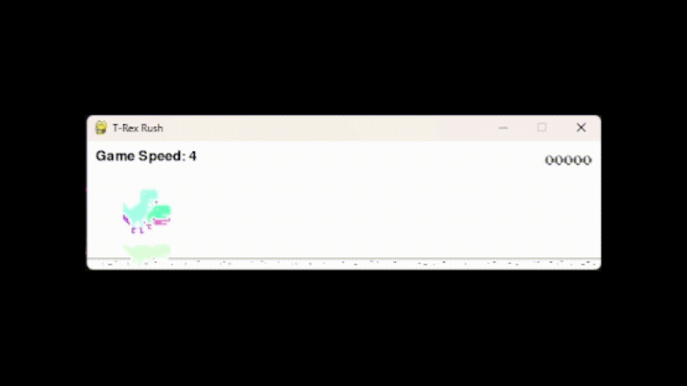

# MultiDinoGame

[VÍDEO - APRESENTAÇÃO DO PROJETO PELA EQUIPE](https://drive.google.com/file/d/1Uc8_tSXfleVqW9XzpAxOqBNMkDgPkEDc/view?usp=sharing)

## Discentes

- Antônio César Nunes de Azevedo Filho
- Felipe Azevedo Ribeiro

## Docente

- Ariel Menezes de Almeida Júnior

---

## Introdução

**Objetivo:** Treinar uma IA capaz de obter a maior pontuação possível no jogo Chrome Dino utilizando um algoritmo genético.

**Metodologia:** Foi implementado um algoritmo genético para simular a evolução de uma população de dinossauros, onde os que possuírem maior score irão gerar descendentes.

## Algoritmo Genético

**Representação:** Cada dinossauro é representado por um conjunto de pesos sinápticos, que determinam sua estratégia de pulo.

```py
self.pesos = [rnd.randint(-1000, 1000) for _ in range(10)]

def tomarDecisao(self, state: list) -> int:
    avg = np.average(state, weights=self.pesos)

    return ACTION_UP if avg > 0 else ACTION_DOWN
```

**Função de Avaliação:** A pontuação obtida pelo dinossauro no jogo é utilizada como medida de aptidão.

### Operadores Genéticos

- Seleção:

  - **Algoritmo Utilizado:** Seleção por torneio (implicitamente implementado ao escolher o dinossauro com maior pontuação a cada geração).
  - **Justificativa:** A seleção por torneio é simples de implementar e apresenta bons resultados.

  ```py
  def selecao(dinos: list[Dinossauro]):
      return max(dinos, key=lambda d: d.gameDino.score)
  ```

- Cross-Over:

  - **Algoritmo Utilizado:** Não utilizado explicitamente neste código.
  - **Justificativa:** A reprodução é realizada clonando o melhor indivíduo e aplicando mutações. Foi assumido que é uma representação "assexuada" de indivíduos.

- Mutação:

  - **Algoritmo Utilizado:** Mutação aleatória de um gene (peso sináptico).

    ```py
    def mutate(self):
        for i in range(len(self.pesos)):
            prob = rnd.random()
            if prob <= MUTATION_RATE:
                self.pesos[i] = rnd.randint(-1000, 1000)
    ```

  - **Justificativa:** A mutação é essencial para explorar novas regiões do espaço de busca e evitar convergência prematura.
  - **Considerações:** Houve a tentativa de implementar a mutação gaussiana, buscando introduzir variações na população. No entanto, a mutação atual demonstrou ser mais eficiente ao convergir para o objetivo do projeto.

### Considerações Finais

Os bugs presentes na biblioteca `MultiDinoGame` exigiram um esforço adicional da equipe para contornar os problemas e garantir a progressão do projeto. Com efeito, devido aos ajustes realizados pelo professor, o algoritmo genético desenvolvido mostrou-se eficaz em aumentar a pontuação média dos dinossauros considerávelmente, demonstrando o potencial da abordagem evolutiva para resolver problemas complexos.

## Exemplos práticos

### Exemplo de geração inicial

```py
POPULATION_SIZE = 300
GENERATIONS = 200
MUTATION_RATE = 0.6
FPS = 400
```



<br>

### Exemplo de avanço de gerações


<br>

### Exemplo de melhor indivíduo


```json
{
  "geracao": 65,
  "pesos_melhor_individuo": [
    686, -445, -651, 576, 498, -562, -292, -320, -234, 209
  ]
}
```

## Gerações e pesos para consulta:

[dinos.json](dinos.json)
